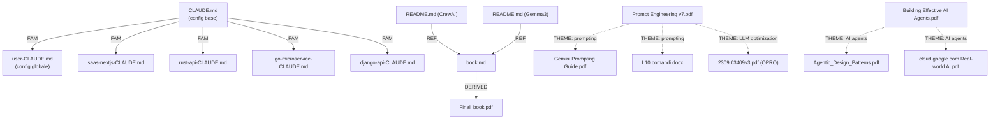

# File Mapper Skill — Guida Completa

## Obiettivo

Dato un percorso cartella (o lista file), produci:
1. **INVENTORY.md** — inventario completo con metadati
2. **MAP.md** — nota indice con tutti i collegamenti, relazioni logiche, pattern e connessioni tra file
3. **GRAPH.md** — grafo testuale delle dipendenze (Mermaid)

---

## Step 1 — Scansione Cartella

```bash
# Elenca tutti i file ricorsivamente con dimensione e data
find <CARTELLA> -type f | sort | while read f; do
  echo "$(stat -c '%s|%Y|%n' "$f")"
done
```

Per ogni file raccogli:
- `path` — percorso relativo
- `name` — nome file con estensione
- `ext` — estensione (`.md`, `.pdf`, `.py`, `.json`, `.csv`, `.txt`, `.docx`, `.js`, `.ts`, `.yaml`, `.toml` …)
- `size_bytes` — dimensione
- `modified` — data ultima modifica
- `type` — categoria: `doc`, `code`, `config`, `data`, `media`, `archive`

**Classificazione tipo per estensione:**

| Estensione | Tipo |
|---|---|
| `.md`, `.txt`, `.docx`, `.pdf` | `doc` |
| `.py`, `.js`, `.ts`, `.rs`, `.go`, `.sh` | `code` |
| `.json`, `.yaml`, `.toml`, `.env`, `.ini` | `config` |
| `.csv`, `.xlsx`, `.sql` | `data` |
| `.png`, `.jpg`, `.svg`, `.mp4` | `media` |
| `.zip`, `.tar`, `.gz` | `archive` |

---

## Step 2 — Estrazione Contenuto e Keyword

Per ogni file (max 2000 caratteri dal testo):

### Testo leggibile (`.md`, `.txt`, `.py`, `.js`, `.ts`, `.json`, `.yaml`, `.csv`)
```python
with open(filepath, 'r', errors='ignore') as f:
    content = f.read(2000)
```

### PDF
```python
import subprocess
content = subprocess.run(['pdftotext', filepath, '-'], capture_output=True, text=True).stdout[:2000]
# Fallback: usa pypdf o pdfplumber
```

### DOCX
```python
import zipfile, re
with zipfile.ZipFile(filepath) as z:
    xml = z.read('word/document.xml').decode('utf-8', errors='ignore')
    content = re.sub(r'<[^>]+>', ' ', xml)[:2000]
```

### Estrazione keyword automatica
```python
import re
from collections import Counter

def extract_keywords(text, top_n=10):
    stopwords = {'the','a','an','is','in','of','to','and','for','with',
                 'di','il','la','le','lo','gli','un','una','che','per',
                 'con','su','da','del','della','dei','delle','degli'}
    words = re.findall(r'\b[a-zA-Z]{4,}\b', text.lower())
    filtered = [w for w in words if w not in stopwords]
    return [w for w, _ in Counter(filtered).most_common(top_n)]
```

---

## Step 3 — Rilevamento Relazioni

Per ogni coppia di file, calcola:

### A. Riferimenti espliciti (citazioni dirette)
Cerca nel testo di ogni file se compaiono nomi di altri file della stessa cartella:
```python
def find_explicit_refs(file_content, all_filenames):
    refs = []
    for fname in all_filenames:
        stem = fname.rsplit('.', 1)[0]  # nome senza estensione
        if stem in file_content or fname in file_content:
            refs.append(fname)
    return refs
```

### B. Similarità tematica (keyword overlap)
```python
def keyword_similarity(kw_a, kw_b):
    set_a, set_b = set(kw_a), set(kw_b)
    if not set_a or not set_b:
        return 0.0
    intersection = set_a & set_b
    union = set_a | set_b
    return len(intersection) / len(union)  # Jaccard similarity

# Soglia relazione: similarity >= 0.2
```

### C. Pattern strutturali
- **Stesso prefisso nome**: `CLAUDE.md`, `user-CLAUDE.md`, `saas-nextjs-CLAUDE.md` → stesso pattern/famiglia
- **Stesso tipo**: tutti i `README.md` sono correlati
- **Stesso progetto**: file con pattern `<project>-<role>.md` → stessa famiglia
- **Padre/figlio**: `book.md` + `Final_book.pdf` → stessa origine
- **Config + Code**: `package.json` + `index.js` → configurazione di un codebase

### D. Categorie relazioni

| Tipo relazione | Codice | Criteri |
|---|---|---|
| Riferimento diretto | `REF` | File A cita esplicitamente file B |
| Stessa famiglia | `FAM` | Stesso prefisso, suffisso o pattern nome |
| Tema condiviso | `THEME` | Jaccard similarity ≥ 0.25 |
| Dipendenza config | `DEP` | Config file + code file stesso progetto |
| Derivato | `DERIVED` | Output di un altro file (es. PDF da MD) |
| Gemello | `TWIN` | Stessa funzione, lingua diversa |

---

## Step 4 — Generazione INVENTORY.md

```markdown
# File Inventory
> Generato: {data_ora} | Cartella: `{path}`

## Riepilogo

| Metrica | Valore |
|---|---|
| Totale file | {n} |
| Documenti | {n_doc} |
| Codice | {n_code} |
| Config | {n_config} |
| Dati | {n_data} |
| Dimensione totale | {size_totale} |

## File per categoria

### Documenti
| File | Dimensione | Modifica | Keyword chiave |
|---|---|---|---|
| [nome.ext](./nome.ext) | 12 KB | 2026-03-15 | ai, agent, workflow |

### Codice
...

### Config
...
```

---

## Step 5 — Generazione MAP.md (Nota Indice con Relazioni)

```markdown
# Knowledge Map
> Cartella: `{path}` | File analizzati: {n} | Data: {data_ora}

## Indice rapido

| # | File | Tipo | Argomento principale | Relazioni |
|---|---|---|---|---|
| 1 | [CLAUDE.md](./CLAUDE.md) | config | Project setup Claude Code | FAM: user-CLAUDE.md, saas-nextjs-CLAUDE.md |
| 2 | [user-CLAUDE.md](./user-CLAUDE.md) | config | User-level Claude preferences | FAM: CLAUDE.md |

---

## Cluster tematici

### Cluster: Claude Code & AI Config
**File:** CLAUDE.md, user-CLAUDE.md, saas-nextjs-CLAUDE.md, rust-api-CLAUDE.md, go-microservice-CLAUDE.md, django-api-CLAUDE.md  
**Tema comune:** configurazione Claude Code, regole progetto, agenti  
**Pattern:** tutti seguono il pattern `*-CLAUDE.md` o `CLAUDE.md`

---

### Cluster: Prompt Engineering & AI
**File:** 22365_3_Prompt Engineering_v7.pdf, workspace_with_gemini_prompting_guide.pdf, I 10 comandi.docx, 2309.03409v3.pdf  
**Tema comune:** tecniche prompting, LLM optimization  
**Pattern:** stesso dominio concettuale

---

### Cluster: AI Agents & Agentic Systems
**File:** anthropic.com-Building Effective AI Agents.pdf, Agentic_Design_Patterns.pdf, cloud.google.com-Real-world gen AI.pdf  
**Tema comune:** design pattern agenti, casi d'uso AI  
**Pattern:** letteratura tecnica AI agenti

---

### Cluster: Progetti CrewAI / Astronomi
**File:** README.md (CrewAI), README.md (Gemma3), book.md, Final_book.pdf  
**Tema comune:** output progetto automatizzato  
**Relazione:** DERIVED — book.md → Final_book.pdf

---

## Relazioni esplicite

```
CLAUDE.md          ←[FAM]→  user-CLAUDE.md
CLAUDE.md          ←[FAM]→  saas-nextjs-CLAUDE.md
book.md            ←[DERIVED]→  Final_book.pdf
README.md (CrewAI) ←[REF]→  book.md
```

---

## File orfani (nessuna relazione rilevata)
- `statusline.json` — config standalone Claude statusline
- `Repo_github_skill.txt` — lista link esterna

---

## Note di pattern

- **Pattern `*-CLAUDE.md`**: tutti i file con suffisso `-CLAUDE.md` sono template per progetti specifici (SaaS, Rust, Go, Django). Il file radice `CLAUDE.md` è il template base, `user-CLAUDE.md` è il livello utente globale.
- **Pattern README**: file README.md multipli indicano sotto-progetti distinti nello stesso spazio.
- **Pattern output**: `book.md` (source) → `Final_book.pdf` (rendered output), tipico flusso markdown → PDF.
```

---

## Step 6 — Generazione GRAPH.md (Mermaid)

```markdown
# Dependency Graph


```

---

## Output finale atteso

```
<output_dir>/
├── INVENTORY.md    ← Tabella completa tutti i file con metadati
├── MAP.md          ← Nota indice con cluster, relazioni, pattern logici
└── GRAPH.md        ← Grafo Mermaid delle dipendenze
```

---

## Regole operative per Claude Code

1. **Leggi prima, analizza dopo** — usa `Read`, `Glob` o `Bash` per raccogliere tutti i file prima di iniziare l'analisi
2. **Non modificare mai i file originali** — solo lettura, output solo in nuovi file
3. **Soglie minime per dichiarare una relazione:**
   - Riferimento diretto: il nome del file compare nel testo dell'altro → sempre REF
   - Stesso pattern nome: ≥ 1 token in comune nel nome → FAM
   - Similarità tematica: Jaccard ≥ 0.20 sulle top-10 keyword → THEME
4. **Gestisci file binari** (PDF, DOCX, XLSX) con estrattori dedicati; se non disponibili, usa solo metadati nome/dimensione
5. **Lingua output**: stessa lingua della richiesta utente (italiano se richiesta in italiano)
6. **Fallback se cartella vuota**: avvisa l'utente e chiedi il percorso corretto

---

## Comando di attivazione in Claude Code

Quando l'utente dice qualcosa come:
> "analizza la cartella `./docs` e crea una mappa con le relazioni tra i file"

Esegui automaticamente:
1. `Bash: find ./docs -type f | sort` → lista file
2. `Read` su ogni file (max 2000 char)
3. Applica Step 2-3 (keyword + relazioni)
4. Scrivi `INVENTORY.md`, `MAP.md`, `GRAPH.md` nella cartella target

