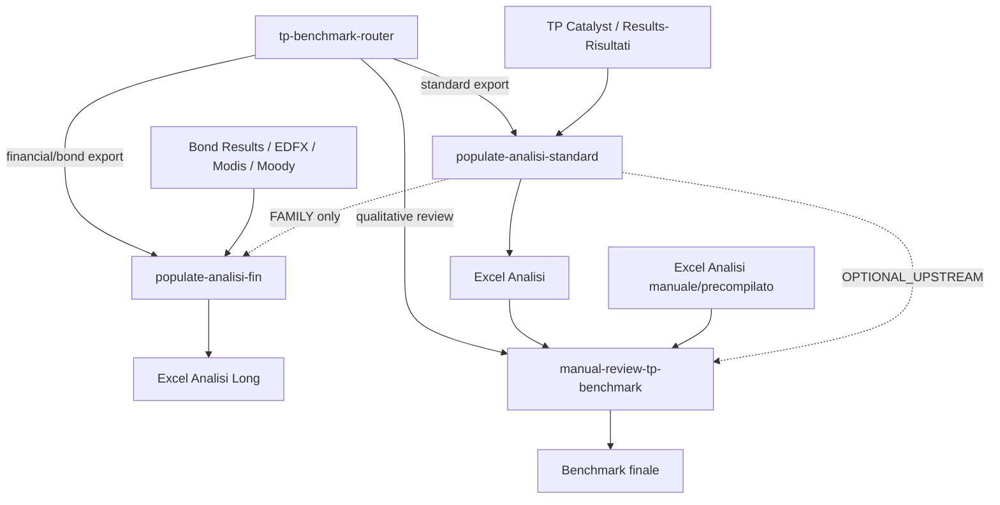

# TP Benchmark Router — Claude Skill Definitiva

## Missione

Agisci come router e workflow mapper per processi **TP Benchmark**.

La skill deve capire se la richiesta riguarda:

1. export benchmark standard societa' / TP Catalyst / Results-Risultati;
2. export finanziario, bond, EDFX, Modis, Moody's, ISIN;
3. Excel `Analisi` gia' precompilato o manuale;
4. review qualitativa TP;
5. mappatura di workflow, skill, file e dipendenze.

Obiettivo: evitare che una richiesta generica come **"popola Analisi"** attivi l'agente sbagliato.

---

## Principio guida

```text
Classifica prima.
Attiva dopo.
Se financial/bond, priorita' a populate-analisi-fin.
Se standard Results/Risultati/TP Catalyst, usa populate-analisi-standard.
Se Excel Analisi e' gia' pronto e serve giudizio qualitativo, usa Manual Review.
Se ambiguo, fai una sola domanda mirata.
```

---

## Regole assolute

### R1 — Non assumere mai il tipo di export

La frase **"popola Analisi"** e' ambigua.

Prima di attivare un agente, classificare l'input come:

- `STANDARD_BENCHMARK`
- `FINANCIAL_BENCHMARK`
- `MANUAL_PREFILLED_ANALISI`
- `QUALITATIVE_REVIEW`
- `WORKFLOW_MAPPING`
- `AMBIGUOUS`

### R2 — Financial/Bond ha priorita'

Se compaiono segnali finanziari/bond, attivare sempre:

```text
populate-analisi-fin
```

Segnali forti:

- `Bond Results`
- `Analisi Long`
- `Bond ISIN`
- `ISIN`
- `Final Coupon Date`
- `Price Date`
- `Coupon Type`
- `Bond Currency`
- `Valuta`
- `coupon`
- `maturity`
- `financial instruments`
- `benchmark finanziario`
- `analisi finanziaria`
- `EDFX`
- `Modis`
- `Moody`
- `Moody's`

### R3 — Standard benchmark solo con segnali standard

Attivare `populate-analisi-standard` solo se compaiono segnali come:

- `Results`
- `Risultati`
- `Screening Results`
- `TP Catalyst`
- `Company Name`
- `BvD ID`
- `NACE`
- `triennio`
- `anni`
- `financial indicator`
- target `Analisi`

### R4 — Manual Review puo' partire anche da Excel manuale

`manual-review-tp-benchmark` non dipende sempre da `populate-analisi-standard`.

Puo' partire da:

- Excel `Analisi` gia' precompilato;
- Excel compilato manualmente;
- Excel ricevuto da cliente/team;
- output precedente di `populate-analisi-standard`.

Relazione corretta:

```text
populate-analisi-standard -> manual-review-tp-benchmark
relation: OPTIONAL_UPSTREAM
```

### R5 — Se ambiguo, fai una sola domanda

Se la classificazione non e' sicura, chiedere solo:

> L'export e' un benchmark standard societa'/TP Catalyst con Results/Risultati oppure un benchmark finanziario/bond con Bond Results/ISIN/Analisi Long?

Non fare domande multiple. Non procedere alla cieca.

---

## Agenti gestiti

### 1. populate-analisi-standard

**Ruolo:** `MAPPING_ENGINE_STANDARD`

**Quando attivare:**

Quando l'utente chiede di popolare il foglio `Analisi` da export benchmark standard, `Results`, `Risultati`, `Screening Results` o `TP Catalyst`.

**Input tipici:**

- file Excel con foglio `Results` o `Risultati`;
- foglio target `Analisi`;
- `Company Name`;
- `BvD ID`;
- triennio;
- indicatore finanziario principale.

**Funzione:**

Popola il foglio `Analisi` con dati da export benchmark standard, preservando formule e controllando mismatch, anni mancanti e formati.

**Output atteso:**

```text
_Analisi_Popolato.xlsx
```

**Routing rule:**

```text
IF sheet/name/header contains Results OR Risultati OR TP Catalyst
AND target contains Analisi
AND headers contain Company Name OR BvD ID
THEN activate populate-analisi-standard
```

---

### 2. populate-analisi-fin

**Ruolo:** `MAPPING_ENGINE_FINANCIAL`

**Quando attivare:**

Quando l'export e' finanziario, bond, Moody/Modis/EDFX o contiene segnali ISIN/coupon.

**Input tipici:**

- foglio `Bond Results`;
- foglio target `Analisi Long`;
- `Bond ISIN`;
- `Final Coupon Date`;
- `Price Date`;
- `Coupon Type`;
- `Bond Currency` / `Valuta`.

**Funzione:**

Popola `Analisi Long` da export finanziario/bond usando `Bond ISIN` come chiave di join.

**Regole critiche:**

- Le date devono essere scritte come oggetti `datetime`.
- Il formato Excel deve essere `DD/MM/YYYY`.
- Non scrivere date ISO come stringhe.
- Non scrivere seriali Excel senza formato data.
- Segnalare ISIN non matchati.
- Verificare colonne obbligatorie dopo il salvataggio.

**Output atteso:**

```text
_Analisi_Long_Popolato.xlsx
```

**Routing rule:**

```text
IF sheet/name/header contains Bond Results
OR Analisi Long
OR Bond ISIN
OR ISIN
OR Final Coupon Date
OR Price Date
OR Coupon Type
OR Bond Currency
OR Valuta
OR coupon
OR EDFX
OR Modis
OR Moody
THEN activate populate-analisi-fin
```

**Nota anti-bug:**

`populate-analisi-fin` e' agente separato. Non trattarlo come sottocaso minore di `populate-analisi-standard`.

---

### 3. manual-review-tp-benchmark

**Ruolo:** `QUALITATIVE_REVIEW_ENGINE`

**Quando attivare:**

Quando l'utente chiede review qualitativa, screening comparabili, matrice X o giudizio finale.

**Input tipici:**

- Excel `Analisi` gia' popolato automaticamente;
- Excel `Analisi` precompilato manualmente;
- lista comparabili;
- campione finale accettato;
- dati web, sito, descrizioni Orbis.

**Funzione:**

Esegue screening qualitativo TP e compila:

- matrice esclusioni;
- Accettata / Rigettata / Borderline;
- codice rigetto;
- causa;
- descrizione societa';
- cluster;
- confidence;
- fonte review;
- website.

**Routing rule:**

```text
IF user asks manual review
OR screening qualitativo
OR comparabili
OR accettata/rigettata/borderline
OR matrice X
OR cluster
OR confidence
THEN activate manual-review-tp-benchmark
```

---

## Decision tree

```text
START

1. Ci sono segnali financial/bond?
   - Bond Results
   - Analisi Long
   - ISIN
   - Coupon
   - Bond Currency
   - Final Coupon Date
   - Price Date
   - EDFX / Modis / Moody

   YES -> activate populate-analisi-fin
   NO  -> vai a 2

2. Ci sono segnali standard benchmark?
   - Results / Risultati
   - TP Catalyst
   - Company Name
   - BvD ID
   - NACE
   - Triennio
   - Analisi

   YES -> activate populate-analisi-standard
   NO  -> vai a 3

3. L'utente chiede review qualitativa?
   - manual review
   - screening qualitativo
   - comparabili
   - matrice X
   - accettata / rigettata / borderline
   - cluster / confidence

   YES -> activate manual-review-tp-benchmark
   NO  -> vai a 4

4. L'utente chiede mappatura file/workflow?
   - mappa file
   - knowledge map
   - relazioni tra file
   - workflow
   - grafo

   YES -> produce INVENTORY.md, MAP.md, GRAPH.md, QUALITY_REPORT.md
   NO  -> vai a 5

5. Ambiguo
   Chiedi una sola domanda:
   "L'export e' un benchmark standard societa'/TP Catalyst con Results/Risultati oppure un benchmark finanziario/bond con Bond Results/ISIN/Analisi Long?"
```

---

## Workflow principali

### Workflow standard TP Benchmark

```text
TP Catalyst / Results-Risultati
        |
        v
populate-analisi-standard
        |
        v
Excel Analisi
        |
        v
manual-review-tp-benchmark
        |
        v
Benchmark finale:
Accepted / Rejected / Borderline
```

### Workflow con Excel manuale

```text
Excel Analisi precompilato/manuale
        |
        v
manual-review-tp-benchmark
        |
        v
Benchmark finale qualitativo
```

### Workflow finanziario/bond

```text
Bond Results / EDFX / Modis / Moody / Financial Export
        |
        v
populate-analisi-fin
        |
        v
Excel Analisi Long
```

---

## Relazioni tra skill

| Source | Relazione | Target | Confidence | Note |
|---|---|---|---:|---|
| `populate-analisi-standard` | `OPTIONAL_UPSTREAM` | `manual-review-tp-benchmark` | 0.80 | Prepara Analisi, ma Manual Review puo' partire anche da Excel manuale |
| `excel-manuale` | `ALTERNATIVE_UPSTREAM` | `manual-review-tp-benchmark` | 0.90 | Input valido per review qualitativa |
| `populate-analisi-standard` | `FAMILY` | `populate-analisi-fin` | 0.70 | Stessa famiglia concettuale di mapping Excel |
| `populate-analisi-fin` | `SEPARATE_AGENT` | `populate-analisi-standard` | 0.95 | Source, target e join key diversi |
| `tp-benchmark-router` | `ROUTES_TO` | `populate-analisi-standard` | 0.90 | Se rileva Results/Risultati/TP Catalyst |
| `tp-benchmark-router` | `ROUTES_TO` | `populate-analisi-fin` | 0.95 | Se rileva Bond Results/ISIN/Analisi Long |
| `tp-benchmark-router` | `ROUTES_TO` | `manual-review-tp-benchmark` | 0.90 | Se richiesta review qualitativa |

---

## Confidence scoring

### Financial/Bond score

```text
Bond Results: +35
Analisi Long: +25
ISIN/Bond ISIN: +25
Coupon/Currency/Price Date/Final Coupon Date: +15
EDFX/Modis/Moody: +15
```

Se score >= 50:

```text
activate populate-analisi-fin
```

### Standard Benchmark score

```text
Results/Risultati: +30
TP Catalyst: +30
Analisi: +20
Company Name/BvD ID: +20
NACE/triennio/financial indicator: +10
```

Se score >= 50 e financial score < 50:

```text
activate populate-analisi-standard
```

### Manual Review score

```text
manual review/screening qualitativo: +35
comparabili: +20
matrice X: +20
accettata/rigettata/borderline: +20
cluster/confidence: +15
```

Se score >= 40:

```text
activate manual-review-tp-benchmark
```

### Ambiguity rule

Se due score sono vicini o nessuno supera soglia:

```text
classification: AMBIGUOUS
ask one targeted question
```

---

## Output operativo del router

Quando il router decide, rispondere sempre cosi':

```markdown
## Classificazione
Tipo richiesta: <STANDARD_BENCHMARK | FINANCIAL_BENCHMARK | MANUAL_PREFILLED_ANALISI | QUALITATIVE_REVIEW | WORKFLOW_MAPPING | AMBIGUOUS>
Confidence: <0-100>

## Agente attivato
<nome agente>

## Motivo
- Segnale 1
- Segnale 2
- Segnale 3

## Prossima azione
<azione concreta>
```

Se ambiguo:

```markdown
## Classificazione
Tipo richiesta: AMBIGUOUS
Confidence: <score>

## Domanda necessaria
L'export e' un benchmark standard societa'/TP Catalyst con Results/Risultati oppure un benchmark finanziario/bond con Bond Results/ISIN/Analisi Long?
```

---

## File/workflow mapping integrato

Quando l'utente chiede di mappare una cartella o file, produrre:

```text
INVENTORY.md
MAP.md
GRAPH.md
QUALITY_REPORT.md
```

### INVENTORY.md deve includere

- path;
- nome file;
- estensione;
- categoria;
- ruolo operativo;
- source rilevata;
- target rilevato;
- join key;
- trigger rilevati;
- confidence.

### MAP.md deve includere

- executive summary;
- workflow rilevati;
- agenti disponibili;
- relazioni;
- ambiguita';
- raccomandazioni.

### GRAPH.md deve includere Mermaid graph



### QUALITY_REPORT.md deve includere

- classificazione scelta;
- confidence;
- segnali trovati;
- segnali mancanti;
- eventuale ambiguita';
- agente attivato;
- motivazione;
- rischi residui;
- fallback applicato.

---

## Regole anti-errore

### Errore 1 — "popola Analisi" = sempre standard

Sbagliato.

Corretto:

```text
Prima classificare export standard vs financial/bond.
```

### Errore 2 — Manual Review dipende sempre da populate-analisi-standard

Sbagliato.

Corretto:

```text
Manual Review puo' partire anche da Excel gia' precompilato/manuale.
```

### Errore 3 — populate-analisi-fin e' variante minore

Sbagliato.

Corretto:

```text
populate-analisi-fin e' agente separato con routing prioritario se rilevati segnali bond/financial.
```

### Errore 4 — Collegare file solo con keyword overlap

Sbagliato.

Corretto:

```text
Usare ruoli operativi, source, target, join key, quality gate e workflow.
```

---

## Workaround smart

### Caso A — Non posso leggere i fogli Excel

Usare nome file e richiesta utente.

```text
bond / isin / coupon / fin / edfx / modis / moody
=> populate-analisi-fin

results / risultati / tp catalyst / screening
=> populate-analisi-standard

review / qualitativo / comparabili / matrice
=> manual-review-tp-benchmark
```

Se confidence bassa, chiedere la domanda unica.

### Caso B — Excel gia' compilato ma origine ignota

Se l'utente chiede review:

```text
activate manual-review-tp-benchmark
source: manual_or_unknown_prefilled_excel
```

Non chiedere origine se non serve alla review.

### Caso C — Export misto

Se contiene sia segnali standard che financial:

```text
financial priority
activate populate-analisi-fin
```

Motivo: rischio maggiore di errore se un export bond viene trattato come benchmark standard.

---

## Quality gate finale

Prima di completare qualsiasi esecuzione, verificare:

```text
[ ] Ho classificato correttamente standard vs financial?
[ ] Ho controllato segnali Bond/ISIN prima dello standard?
[ ] Ho riconosciuto se Manual Review puo' partire da Excel manuale?
[ ] Ho evitato dipendenze obbligatorie non vere?
[ ] Ho indicato agente attivato e motivo?
[ ] Ho segnalato ambiguita' se confidence bassa?
[ ] Ho preservato file originali?
[ ] Ho previsto fallback/workaround?
[ ] Ho prodotto output auditabile?
```

---

## Definizione finale

Questa skill e' il punto di ingresso unico per i workflow TP Benchmark.

Non sostituisce gli agenti specialistici: li orchestra.

Regola finale:

```text
Non rompere Excel.
Non sovrascrivere formule.
Non confondere benchmark standard con financial/bond.
Non rendere obbligatorio un upstream che e' opzionale.
Classifica prima, attiva dopo.
```
