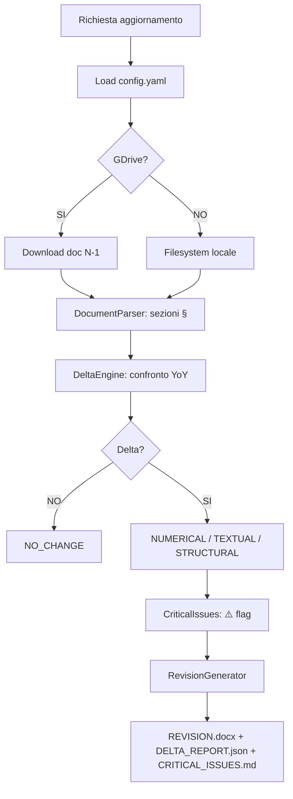

valbruna-tp-dpc

**Version:** 1.1 | **Scope:** Analisi delta annuale documenti Transfer Pricing (DN + MF)  
**Target:** Acciaierie Valbruna SpA + Amenduni Nicola SpA | **GDrive:** ✅ Opzionale

---

## 🎯 OBIETTIVO

Automatizza l'aggiornamento annuale dei documenti TP riducendo l'effort del ~90%:

1. Lettura DOCX da filesystem locale o Google Drive
2. Analisi Delta YoY sezione per sezione
3. Flagging tematiche critiche (prezzi, metodi, nuove controparti)
4. Output con track changes minimali + report JSON + Markdown

---

## 📊 WORKFLOW



---

## 🗂️ DOCUMENTI TARGET (percorsi preconfigurati)

| Tipo | FY24 | FY23 |
|------|------|------|
| Valbruna DN | `FY 24/Valbruna/DN/Acciaierie Valbruna DN FY 24 Final.docx` | `FY 23/Valbruna/DN/Acciaierie Valbruna DN FY 23 Final.docx` |
| Valbruna MF | `FY 24/Valbruna/MF/Valbruna MF FY24 Final Draft.docx` | `FY 23/Valbruna/MF/Valbruna MF FY23 Final Draft.docx` |
| Amenduni DN | `FY 24/Amenduni/DN/Amenduni Nicola DN FY 24  Final.docx` | `FY 23/Amenduni/DN/Amenduni Nicola DN FY 23 Final.docx` |
| Amenduni MF | `FY 24/Amenduni/MF/Amenduni MF Final FY24.docx` | `FY 23/Amenduni/MF/Amenduni MF FY23 Final.docx` |

---

## 🚀 UTILIZZO RAPIDO

```powershell
$PY = "C:\Users\luca.consalter\AppData\Local\Python\pythoncore-3.14-64\python.exe"

# Singolo documento
& $PY src/main.py --doc-type valbruna_dn --current-fy fy24 --previous-fy fy23 --flag-critical-issues

# Tutti e 4 i documenti in sequenza
.\run_tp_annual_update.ps1

# Solo check pre-firma
& $PY src/main.py --current-doc "file.docx" --check-only
```

**Output generati in `./output/`:**

- `*_REVISION_YYYYMMDD.docx` — track changes visivi (rosso barrato → giallo grassetto)
- `DELTA_REPORT_YYvsYY.json` — analisi JSON completa
- `CRITICAL_ISSUES_YYYYMMDD.md` — issue prioritizzate

---

## ⚙️ SOGLIE DELTA (configurabili in config.yaml)

| Soglia | Valore | Effetto |
|--------|--------|---------|
| `numerical_tolerance` | 1% | Ignorato se < 1% |
| `price_variance_alert` | 10% | Flag ⚠️ PRICE_VARIANCE |
| `volume_variance_alert` | 15% | Flag ⚠️ VOLUME_VARIANCE |
| `text_similarity_threshold` | 95% | Sotto → cambio testuale |

---

## 📋 TEST RESULTS (15/15 ✅)

```
Python 3.14.0, pytest-9.0.2
TestDocumentParser::test_empty_document                 PASSED
TestDocumentParser::test_extract_numbers_italian_format PASSED
TestDocumentParser::test_parse_multiple_sections        PASSED
TestDocumentParser::test_parse_single_section           PASSED
TestDeltaEngine::test_new_section_flagged               PASSED
TestDeltaEngine::test_no_change_identical_documents     PASSED
TestDeltaEngine::test_numerical_delta_tolerance         PASSED
TestDeltaEngine::test_numerical_update_detected         PASSED
TestDeltaEngine::test_preserved_section_never_changed   PASSED
TestDeltaEngine::test_text_similarity_calculation       PASSED
TestCriticalIssues::test_clean_document_no_issues       PASSED
TestCriticalIssues::test_multiple_tp_methods_warning    PASSED
TestCriticalIssues::test_placeholder_detection          PASSED
TestRevisionGenerator::test_json_report_generated       PASSED
TestRevisionGenerator::test_critical_issues_markdown    PASSED
=================== 15 passed in 1.43s ===================
```

---

## 📁 STRUTTURA FILE

```
skills/tp-delta-analyzer/
├── SKILL.md                    ← Questo file (self-contained)
├── config.yaml                 ← Configurazione Valbruna
├── requirements.txt            ← Dipendenze Python
├── run_tp_annual_update.ps1    ← Script 1-click
├── src/
│   ├── main.py                 ← CLI orchestrator
│   ├── gdrive_connector.py     ← GDrive + fallback locale
│   ├── document_parser.py      ← Parser sezioni § DOCX
│   ├── delta_engine.py         ← Core YoY comparison
│   ├── critical_issues.py      ← Flagging anomalie
│   └── revision_generator.py  ← Output DOCX/JSON/MD
├── templates/
│   ├── delta_report.json
│   └── critical_issues.md
└── tests/
    └── test_delta_engine.py    ← 15 unit test
```

---

## 🗃️ FILE: `requirements.txt`

```text
python-docx>=0.8.11
pandas>=2.0.0
PyYAML>=6.0
google-auth>=2.0.0
google-auth-oauthlib>=1.0.0
google-auth-httplib2>=0.1.0
google-api-python-client>=2.0.0
diff-match-patch>=20200713
pydantic>=2.0.0
pytest>=7.0.0
colorama>=0.4.6
```

**Installazione:**

```powershell
C:\Users\luca.consalter\AppData\Local\Python\pythoncore-3.14-64\python.exe -m pip install -r requirements.txt
```

---

## 🗃️ FILE: `config.yaml`

```yaml
# TP Delta Analyzer — Configurazione Gruppo Valbruna v1.1

local:
  project_root: "C:\\Users\\luca.consalter\\projects\\Acciaierie Valbruna"
  valbruna_dn:
    fy24: "FY 24\\Valbruna\\DN\\Acciaierie Valbruna DN FY 24 Final.docx"
    fy23: "FY 23\\Valbruna\\DN\\Acciaierie Valbruna DN FY 23 Final.docx"
    fy22: "FY2022\\8. Localfile\\Acciaierie Valbruna FY 2022_Localfile Final.docx"
  valbruna_mf:
    fy24: "FY 24\\Valbruna\\MF\\Valbruna MF FY24 Final Draft.docx"
    fy23: "FY 23\\Valbruna\\MF\\Valbruna MF FY23 Final Draft.docx"
    fy22: "FY2022\\16. Masterfile\\Acciaierie Valbruna_Masterfile_FY2022 _Final.docx"
  amenduni_dn:
    fy24: "FY 24\\Amenduni\\DN\\Amenduni Nicola DN FY 24  Final.docx"
    fy23: "FY 23\\Amenduni\\DN\\Amenduni Nicola DN FY 23 Final.docx"
  amenduni_mf:
    fy24: "FY 24\\Amenduni\\MF\\Amenduni MF Final FY24.docx"
    fy23: "FY 23\\Amenduni\\MF\\Amenduni MF FY23 Final.docx"

gdrive:
  enabled: false
  credentials_file: "credentials/gdrive_service_account.json"
  root_folder: "Valbruna/Transfer_Pricing"

parsing:
  section_markers: ["§", "##", "SECTION", "Sezione"]
  section_id_pattern: '(\d+\.\d+(?:\.\d+)?)'
  preserve_sections: ["1.1", "2.1", "4.1", "4.3"]
  known_units: ["EUR", "M€", "€", "USD", "GBP", "MT", "kg", "%", "mio"]

delta_thresholds:
  numerical_tolerance: 0.01
  price_variance_alert: 0.10
  volume_variance_alert: 0.15
  text_similarity_threshold: 0.95

critical_flags:
  benchmark_violation: true
  method_change: true
  new_transaction_type: true
  missing_pbc: true
  new_counterparty: true
  tp_method_keywords:
    CUP: ["CUP", "comparable uncontrolled price", "prezzo di libera concorrenza"]
    TNMM: ["TNMM", "transactional net margin", "margine netto"]
    COST_PLUS: ["cost plus", "maggiorazione sui costi", "costo maggiorato"]
    RESALE_PRICE: ["resale price", "prezzo di rivendita"]
    PROFIT_SPLIT: ["profit split", "ripartizione degli utili"]

output:
  track_changes_author: "TP Automation Engine v1.1"
  track_changes_date_format: "%Y-%m-%d %H:%M"
  generate_json_report: true
  generate_markdown_summary: true
  default_output_dir: "./output"
  naming:
    revision_suffix: "_REVISION"
    delta_report_prefix: "DELTA_REPORT_"
    critical_issues_prefix: "CRITICAL_ISSUES_"
```

---

## 🐍 FILE: `src/gdrive_connector.py`

```python
"""GDrive Connector — service account auth + local filesystem fallback."""
from __future__ import annotations
import io, os, shutil
from pathlib import Path
from typing import Optional, Tuple
import yaml


class GDriveConnector:
    def __init__(self, config_path: str = "config.yaml"):
        p = Path(config_path)
        if not p.exists():
            p = Path(__file__).parent.parent / "config.yaml"
        with open(p, "r", encoding="utf-8") as f:
            self.config = yaml.safe_load(f)
        self.gdrive_enabled = self.config.get("gdrive", {}).get("enabled", False)
        self._service = None
        if self.gdrive_enabled:
            self._init_gdrive()

    def find_document(self, filename_pattern: str, folder_path: str) -> Tuple[str, str]:
        if not self.gdrive_enabled:
            raise RuntimeError("GDrive non abilitato. Imposta gdrive.enabled: true in config.yaml")
        folder_id = self._get_folder_id(folder_path)
        results = self._service.files().list(
            q=f"name contains '{filename_pattern}' and '{folder_id}' in parents and trashed=false",
            fields="files(id,name,modifiedTime)", orderBy="modifiedTime desc"
        ).execute()
        files = results.get("files", [])
        if not files:
            raise FileNotFoundError(f"Nessun file '{filename_pattern}' in '{folder_path}'")
        return files[0]["id"], files[0]["name"]

    def download_document(self, file_id: str, output_path: str) -> str:
        from googleapiclient.http import MediaIoBaseDownload
        os.makedirs(Path(output_path).parent, exist_ok=True)
        req = self._service.files().get_media(fileId=file_id)
        fh = io.FileIO(output_path, "wb")
        dl = MediaIoBaseDownload(fh, req)
        done = False
        while not done:
            status, done = dl.next_chunk()
            print(f"  Download {int(status.progress()*100)}%")
        return output_path

    def get_local_document(self, doc_type: str, fy: str) -> Optional[str]:
        lc = self.config.get("local", {})
        rel = lc.get(doc_type, {}).get(fy)
        if not rel:
            return None
        full = os.path.join(lc.get("project_root", ""), rel)
        return full if os.path.exists(full) else None

    def copy_to_temp(self, source: str, temp_dir: str, filename: str) -> str:
        os.makedirs(temp_dir, exist_ok=True)
        dest = os.path.join(temp_dir, filename)
        shutil.copy2(source, dest)
        return dest

    def _init_gdrive(self):
        from google.oauth2.service_account import Credentials
        from googleapiclient.discovery import build
        creds_file = self.config["gdrive"].get("credentials_file")
        if not creds_file or not Path(creds_file).exists():
            raise FileNotFoundError(f"Credenziali GDrive non trovate: {creds_file}")
        creds = Credentials.from_service_account_file(
            creds_file, scopes=["https://www.googleapis.com/auth/drive.readonly"])
        self._service = build("drive", "v3", credentials=creds)

    def _get_folder_id(self, folder_path: str) -> str:
        parent_id = "root"
        for part in folder_path.strip("/").split("/"):
            res = self._service.files().list(
                q=f"name='{part}' and mimeType='application/vnd.google-apps.folder' "
                  f"and '{parent_id}' in parents and trashed=false",
                fields="files(id)").execute()
            folders = res.get("files", [])
            if not folders:
                raise FileNotFoundError(f"Cartella '{part}' non trovata in '{folder_path}'")
            parent_id = folders[0]["id"]
        return parent_id
```

---

## 🐍 FILE: `src/document_parser.py`

```python
"""DocumentParser — scompone DOCX in sezioni § con estrazione numeri IT/EN."""
from __future__ import annotations
import re
from dataclasses import dataclass, field
from pathlib import Path
from typing import Dict, List, Optional
import yaml
from docx import Document
from docx.text.paragraph import Paragraph


@dataclass
class SectionData:
    section_id: str
    title: str
    paragraphs: List[str] = field(default_factory=list)
    tables: List[List[List[str]]] = field(default_factory=list)
    numbers: Dict[str, float] = field(default_factory=dict)
    raw_text: str = ""
    paragraph_indices: List[int] = field(default_factory=list)

    def full_text(self) -> str:
        return "\n".join([self.title] + [p for p in self.paragraphs if p.strip()])


class DocumentParser:
    NUMBER_PATTERNS = [
        (r'(?:€|EUR|USD|GBP|M€)\s*([\d]{1,3}(?:[\.,]\d{3})*(?:[,\.]\d+)?)', 'currency'),
        (r'([\d]{1,3}(?:[\.,]\d{3})*(?:[,\.]\d+)?)\s*(?:MT|kg|ton|t\b)', 'quantity'),
        (r'([\d]{1,3}(?:[,\.]\d+)?)\s*%', 'percentage'),
        (r'\b([\d]{1,3}(?:[\.,]\d{3})+(?:[,\.]\d+)?)\b', 'number'),
    ]
    HEADING_STYLES = {"heading 1","heading 2","heading 3","heading 4",
                      "titolo 1","titolo 2","titolo 3","titolo 4"}

    def __init__(self, config: Optional[dict] = None):
        if config is None:
            cp = Path(__file__).parent.parent / "config.yaml"
            with open(cp, "r", encoding="utf-8") as f:
                config = yaml.safe_load(f)
        self.config = config
        pc = config.get("parsing", {})
        self.section_markers = pc.get("section_markers", ["§", "##"])
        self.preserve_sections = set(pc.get("preserve_sections", []))
        self._sid_re = re.compile(pc.get("section_id_pattern", r'(\d+\.\d+(?:\.\d+)?)'))

    def parse(self, doc_path: str) -> Dict[str, SectionData]:
        doc = Document(doc_path)
        sections: Dict[str, SectionData] = {}
        cur: Optional[SectionData] = None
        for i, para in enumerate(doc.paragraphs):
            if self._is_header(para):
                if cur:
                    self._finalize(cur); sections[cur.section_id] = cur
                cur = SectionData(self._extract_id(para.text), para.text.strip(), paragraph_indices=[i])
            elif cur and para.text.strip():
                cur.paragraphs.append(para.text)
                cur.paragraph_indices.append(i)
        if cur:
            self._finalize(cur); sections[cur.section_id] = cur
        self._attach_tables(doc, sections)
        if not sections:
            fb = SectionData("0", "[Documento intero]",
                             paragraphs=[p.text for p in doc.paragraphs if p.text.strip()])
            self._finalize(fb); sections["0"] = fb
        return sections

    def is_preserved(self, section_id: str) -> bool:
        return section_id in self.preserve_sections

    def _is_header(self, para: Paragraph) -> bool:
        text = para.text.strip()
        if not text: return False
        sn = (para.style.name or "").lower()
        if any(sn.startswith(h) for h in self.HEADING_STYLES) and self._sid_re.search(text):
            return True
        if "§" in self.section_markers and text.startswith("§"): return True
        if "##" in self.section_markers and text.startswith("##"): return True
        if re.match(r'^\d+\.\d+(?:\.\d+)?\s+\S', text): return True
        if (text.upper().startswith("SECTION") or text.startswith("Sezione")) and self._sid_re.search(text):
            return True
        return False

    def _extract_id(self, text: str) -> str:
        m = self._sid_re.search(text)
        if m: return m.group(1)
        return re.sub(r'[^\w.]', '_', text[:40]).strip('_') or "unknown"

    def _extract_numbers(self, text: str) -> Dict[str, float]:
        nums: Dict[str, float] = {}
        for pattern, cat in self.NUMBER_PATTERNS:
            for m in re.finditer(pattern, text, re.IGNORECASE):
                v = self._parse_num(m.group(1))
                if v and v > 0:
                    ctx = re.sub(r'\s+', '_', text[max(0,m.start()-15):m.start()].strip().lower()[-12:])
                    nums[f"{ctx or cat}_{cat}_{round(v,2)}"] = v
        return nums

    def _parse_num(self, raw: str) -> Optional[float]:
        if not raw: return None
        try:
            if ',' in raw and '.' in raw:
                clean = raw.replace('.','').replace(',','.') if raw.index('.') < raw.index(',') else raw.replace(',','')
            elif ',' in raw:
                pts = raw.split(',')
                clean = raw.replace(',','.') if len(pts)==2 and len(pts[1])<=2 else raw.replace(',','')
            else:
                clean = raw.replace('.','') if len(raw)>4 else raw
            return float(clean)
        except: return None

    def _attach_tables(self, doc, sections: Dict[str, SectionData]):
        if not sections: return
        sids = list(sections.keys())
        for table in doc.tables:
            td = [[c.text.strip() for c in r.cells] for r in table.rows]
            last = sections[sids[-1]]
            last.tables.append(td)
            for row in td:
                for cell in row:
                    last.numbers.update(self._extract_numbers(cell))

    def _finalize(self, s: SectionData):
        s.raw_text = s.full_text()
        s.numbers = self._extract_numbers(s.raw_text)
```

---

## 🐍 FILE: `src/delta_engine.py`

```python
"""DeltaEngine — confronto YoY sezione per sezione."""
from __future__ import annotations
import difflib, re
from dataclasses import dataclass, field
from pathlib import Path
from typing import Dict, List, Optional
import yaml
from document_parser import DocumentParser, SectionData


@dataclass
class NumericalDelta:
    key: str; old_value: float; new_value: float
    delta_abs: float; delta_pct: float; context: str = ""

@dataclass
class SectionDelta:
    section_id: str; section_title: str; change_type: str
    old_content: str; new_content: str
    numerical_deltas: List[NumericalDelta] = field(default_factory=list)
    critical_flags: List[str] = field(default_factory=list)
    update_required: bool = False; revision_text: str = ""
    text_similarity: float = 1.0; is_preserved: bool = False


class DeltaEngine:
    def __init__(self, config: Optional[dict] = None):
        if config is None:
            with open(Path(__file__).parent.parent/"config.yaml","r",encoding="utf-8") as f:
                config = yaml.safe_load(f)
        self.config = config
        t = config.get("delta_thresholds", {})
        self.preserve = set(config.get("parsing",{}).get("preserve_sections",[]))
        self.parser = DocumentParser(config)
        self.tol = t.get("numerical_tolerance", 0.01)
        self.price_alert = t.get("price_variance_alert", 0.10)
        self.vol_alert = t.get("volume_variance_alert", 0.15)
        self.text_thr = t.get("text_similarity_threshold", 0.95)

    def analyze(self, current: str, previous: str) -> List[SectionDelta]:
        print(f"\n📂 Parsing corrente: {Path(current).name}")
        sc = self.parser.parse(current)
        print(f"📂 Parsing precedente: {Path(previous).name}")
        sp = self.parser.parse(previous)
        deltas = []
        for sid, cs in sc.items():
            deltas.append(self._compare(sid, sp[sid], cs) if sid in sp
                          else SectionDelta(sid, cs.title, "NEW", "", cs.raw_text,
                                            critical_flags=["⚠️ NEW_SECTION"],
                                            update_required=True,
                                            revision_text=f"[NUOVA SEZIONE]\n{cs.raw_text}"))
        for sid, ps in sp.items():
            if sid not in sc:
                deltas.append(SectionDelta(sid, ps.title, "STRUCTURAL", ps.raw_text, "",
                                           critical_flags=["⚠️ REMOVED_SECTION"], update_required=True))
        return deltas

    def get_summary(self, deltas: List[SectionDelta]) -> dict:
        return {k: sum(1 for d in deltas if getattr(d,"change_type","") == v)
                for k,v in [("no_change","NO_CHANGE"),("numerical_updates","NUMERICAL"),
                             ("textual_changes","TEXTUAL"),("structural_changes","STRUCTURAL"),
                             ("new_sections","NEW")]} | {
            "total_sections": len(deltas),
            "sections_requiring_update": sum(1 for d in deltas if d.update_required),
            "critical_issues_total": sum(len(d.critical_flags) for d in deltas),
        }

    def _compare(self, sid: str, old: SectionData, new: SectionData) -> SectionDelta:
        if sid in self.preserve:
            return SectionDelta(sid, new.title, "NO_CHANGE", old.raw_text, new.raw_text,
                                is_preserved=True, revision_text=new.raw_text)
        nd = self._compare_numbers(old.numbers, new.numbers)
        sim = self._similarity(old.raw_text, new.raw_text)
        txt_chg = sim < self.text_thr
        if not nd and not txt_chg: ct, upd = "NO_CHANGE", False
        elif nd and not txt_chg: ct, upd = "NUMERICAL", True
        elif txt_chg and not nd: ct, upd = "TEXTUAL", True
        else: ct, upd = "STRUCTURAL", True
        flags = self._critical(sid, nd, old, new)
        if flags: upd = True
        return SectionDelta(sid, new.title, ct, old.raw_text, new.raw_text, nd, flags,
                            upd, self._revtext(old, new, nd, ct), sim)

    def _compare_numbers(self, old: dict, new: dict) -> List[NumericalDelta]:
        out = []
        for k in new:
            if k in old:
                d = self._calc(k, old[k], new[k])
                if d: out.append(d)
        matched_n = {d.new_value for d in out}
        matched_o = {d.old_value for d in out}
        for nk, nv in new.items():
            if nv in matched_n: continue
            for ok, ov in old.items():
                if ov in matched_o or ov==0: continue
                ob = re.sub(r'_[\d.]+$','',ok); nb = re.sub(r'_[\d.]+$','',nk)
                if ob==nb and nb:
                    d = self._calc(nb, ov, nv)
                    if d: out.append(d); matched_o.add(ov); matched_n.add(nv); break
        return out

    def _calc(self, key, old, new) -> Optional[NumericalDelta]:
        if old==0: return NumericalDelta(key,0,new,abs(new),1.0,key) if new else None
        pct = abs((new-old)/old)
        return NumericalDelta(key,old,new,abs(new-old),pct,key) if pct>self.tol else None

    def _similarity(self, a: str, b: str) -> float:
        if not a and not b: return 1.0
        if not a or not b: return 0.0
        return difflib.SequenceMatcher(None,
            re.sub(r'\s+',' ',a.lower()), re.sub(r'\s+',' ',b.lower())).ratio()

    def _critical(self, sid, nd, old, new) -> List[str]:
        flags = []
        cfg = self.config.get("critical_flags", {})
        for d in nd:
            if any(w in d.key.lower() for w in ["price","prezzo","eur","usd","currency"]) and d.delta_pct>self.price_alert:
                flags.append(f"⚠️ PRICE_VARIANCE [{sid}]: {d.old_value:,.2f}→{d.new_value:,.2f} ({d.delta_pct*100:.1f}%)")
            if any(w in d.key.lower() for w in ["quantity","volume","mt","kg"]) and d.delta_pct>self.vol_alert:
                flags.append(f"⚠️ VOLUME_VARIANCE [{sid}]: {d.old_value:,.2f}→{d.new_value:,.2f} ({d.delta_pct*100:.1f}%)")
        if cfg.get("method_change"):
            kw = cfg.get("tp_method_keywords", {})
            om = {m for m,ks in kw.items() if any(k.lower() in old.raw_text.lower() for k in ks)}
            nm = {m for m,ks in kw.items() if any(k.lower() in new.raw_text.lower() for k in ks)}
            if om!=nm: flags.append(f"⚠️ METHOD_CHANGE [{sid}]: rimosso={om-nm} aggiunto={nm-om}")
        if self._similarity(old.raw_text,new.raw_text)<0.70:
            flags.append(f"⚠️ MAJOR_REWRITE [{sid}]")
        return flags

    def _revtext(self, old, new, nd, ct) -> str:
        if ct=="NO_CHANGE": return new.raw_text
        if ct=="NUMERICAL":
            t = new.raw_text
            for d in nd:
                for os,ns in zip([f"{d.old_value:,.2f}",f"{d.old_value:,.0f}"],
                                 [f"{d.new_value:,.2f}",f"{d.new_value:,.0f}"]):
                    if os in t: t=t.replace(os,f"~~{os}~~ **{ns}**",1); break
            return t
        diff = "\n".join(difflib.unified_diff(
            old.raw_text.splitlines(keepends=True),
            new.raw_text.splitlines(keepends=True), lineterm=""))
        return f"```diff\n{diff}\n```"

    def _fmt_it(self, v: float) -> str:
        return f"{v:,.2f}".replace(",","X").replace(".",",").replace("X",".")
```

---

## 🐍 FILE: `src/critical_issues.py`

```python
"""CriticalIssuesChecker — analisi standalone di un singolo documento."""
from __future__ import annotations
import re
from dataclasses import dataclass
from datetime import datetime
from pathlib import Path
from typing import Dict, List, Optional
import yaml
from document_parser import DocumentParser, SectionData


@dataclass
class CriticalIssue:
    severity: str; category: str; section_id: str
    description: str; action_required: str


class CriticalIssuesChecker:
    def __init__(self, config: Optional[dict] = None):
        if config is None:
            with open(Path(__file__).parent.parent/"config.yaml","r",encoding="utf-8") as f:
                config = yaml.safe_load(f)
        self.config = config
        self.flags_cfg = config.get("critical_flags", {})
        self.parser = DocumentParser(config)

    def check_document(self, doc_path: str) -> List[CriticalIssue]:
        sections = self.parser.parse(doc_path)
        issues = []
        for sid, sec in sections.items():
            issues.extend(self._check_section(sid, sec))
        issues.extend(self._check_completeness(sections))
        return sorted(issues, key=lambda x: {"ERROR":0,"WARNING":1,"INFO":2}[x.severity])

    def format_report(self, issues: List[CriticalIssue], doc_name: str = "") -> str:
        if not issues:
            return f"# ✅ Nessuna Issue Critica\n\n**Documento:** {doc_name}\n"
        errs = [i for i in issues if i.severity=="ERROR"]
        warns = [i for i in issues if i.severity=="WARNING"]
        lines = [f"# ⚠️ Report Issue Critiche",f"",f"**Documento:** {doc_name}",
                 f"**Errori:** {len(errs)} 🔴 | **Warning:** {len(warns)} ⚠️","","---",""]
        for sev,lst in [("ERRORI",errs),("WARNING",warns)]:
            if not lst: continue
            lines.append(f"## {'🔴' if sev=='ERRORI' else '⚠️'} {sev}\n")
            for i in lst:
                lines += [f"### [{i.section_id}] {i.category}","",
                          f"**Descrizione:** {i.description}","",
                          f"**Azione:** {i.action_required}","","---",""]
        return "\n".join(lines)

    def _check_section(self, sid: str, sec: SectionData) -> List[CriticalIssue]:
        issues = []
        text = sec.raw_text
        # Placeholder non sostituiti
        if re.search(r'\[INSERT[^\]]*\]|\[DA COMPLETARE[^\]]*\]|\[TBD\]|<TBD>', text, re.IGNORECASE):
            issues.append(CriticalIssue("ERROR","UNFILLED_PLACEHOLDER",sid,
                "Placeholder non sostituiti nel testo.","Completare prima della firma."))
        # Multipli metodi TP
        kws = self.flags_cfg.get("tp_method_keywords", {})
        methods = [m for m,ks in kws.items() if any(k.lower() in text.lower() for k in ks)]
        primary = {"CUP","TNMM","COST_PLUS","RESALE_PRICE","PROFIT_SPLIT"}
        if len([m for m in methods if m in primary]) > 1:
            issues.append(CriticalIssue("WARNING","MULTIPLE_TP_METHODS",sid,
                f"Più metodi primari: {methods}.","Chiarire metodo principale vs corroborativo."))
        # Anni obsoleti
        old_years = [y for y in re.findall(r'\b(20\d{2})\b',text) if int(y)<datetime.now().year-2]
        if old_years:
            issues.append(CriticalIssue("INFO","STALE_YEAR_REFERENCE",sid,
                f"Anni potenzialmente obsoleti: {sorted(set(int(y) for y in old_years))}.","Verificare se intenzionale."))
        return issues

    def _check_completeness(self, sections: Dict[str,SectionData]) -> List[CriticalIssue]:
        issues = []
        required = {"1":"Premessa","2":"Descrizione società","3":"Transazioni","4":"FAR Analysis","5":"Metodo TP"}
        for rid, rdesc in required.items():
            if not any(s==rid or s.startswith(f"{rid}.") for s in sections):
                issues.append(CriticalIssue("WARNING","MISSING_SECTION",rid,
                    f"Sezione '{rdesc}' non trovata.",f"Verificare numerazione o aggiungere sezione {rid}."))
        return issues
```

---

## 🐍 FILE: `src/revision_generator.py`

```python
"""RevisionGenerator — produce REVISION.docx + DELTA_REPORT.json + CRITICAL_ISSUES.md."""
from __future__ import annotations
import json, os
from datetime import datetime
from pathlib import Path
from typing import List, Optional
import yaml
from delta_engine import NumericalDelta, SectionDelta


class RevisionGenerator:
    def __init__(self, config: Optional[dict] = None):
        if config is None:
            with open(Path(__file__).parent.parent/"config.yaml","r",encoding="utf-8") as f:
                config = yaml.safe_load(f)
        oc = config.get("output", {})
        self.author = oc.get("track_changes_author","TP Automation Engine")
        self.timestamp = datetime.now().strftime(oc.get("track_changes_date_format","%Y-%m-%d %H:%M"))

    def generate_revision_document(self, original: str, deltas: List[SectionDelta], out: str) -> str:
        from docx import Document
        from docx.shared import RGBColor
        from docx.enum.text import WD_COLOR_INDEX
        import re
        os.makedirs(Path(out).parent, exist_ok=True)
        doc = Document(original)
        delta_map = {d.section_id: d for d in deltas if d.update_required}
        sid_re = re.compile(r'(\d+\.\d+(?:\.\d+)?)')
        cur_sid = None
        for para in doc.paragraphs:
            m = sid_re.search(para.text)
            if m and ("§" in para.text or para.text[:5].count(".")>0): cur_sid = m.group(1)
            if cur_sid and cur_sid in delta_map:
                d = delta_map[cur_sid]
                if d.change_type == "NUMERICAL":
                    self._apply_num(para, d)
                elif d.change_type in ("TEXTUAL","STRUCTURAL"):
                    if d.section_id in para.text:
                        run = para.add_run(f" ⚠️ [{d.change_type}: REVISIONE RICHIESTA]")
                        run.font.bold = True
                        run.font.highlight_color = WD_COLOR_INDEX.YELLOW
        doc.save(out); print(f"  ✅ REVISION.docx: {out}"); return out

    def _apply_num(self, para, delta: SectionDelta):
        from docx.shared import RGBColor
        from docx.enum.text import WD_COLOR_INDEX
        text = para.text
        for nd in delta.numerical_deltas:
            for os, ns in zip([f"{nd.old_value:,.2f}",f"{nd.old_value:,.0f}"],
                              [f"{nd.new_value:,.2f}",f"{nd.new_value:,.0f}"]):
                if os not in text: continue
                parts = text.split(os, 1)
                para.clear()
                if parts[0]: para.add_run(parts[0])
                r_old = para.add_run(os); r_old.font.strike=True; r_old.font.color.rgb=RGBColor(255,0,0)
                para.add_run(" → ")
                r_new = para.add_run(ns); r_new.font.bold=True; r_new.font.highlight_color=WD_COLOR_INDEX.YELLOW
                if parts[1]: para.add_run(parts[1])
                text = para.text; break

    def generate_delta_report_json(self, deltas: List[SectionDelta], out: str, metadata: Optional[dict]=None) -> str:
        os.makedirs(Path(out).parent, exist_ok=True)
        report = {
            "metadata": {"generated_at":self.timestamp,"generated_by":self.author,
                        "total_sections": len(deltas),
                        "sections_modified": sum(1 for d in deltas if d.update_required),
                        "critical_issues_count": sum(len(d.critical_flags) for d in deltas),
                        **(metadata or {})},
            "sections": [{"section_id":d.section_id,"section_title":d.section_title,
                          "change_type":d.change_type,"update_required":d.update_required,
                          "text_similarity_pct":round(d.text_similarity*100,1),
                          "numerical_deltas":[{"key":n.key,"old":n.old_value,"new":n.new_value,
                                               "delta_pct":f"{n.delta_pct*100:.2f}%"} for n in d.numerical_deltas],
                          "critical_flags":d.critical_flags} for d in deltas]
        }
        with open(out,"w",encoding="utf-8") as f: json.dump(report,f,indent=2,ensure_ascii=False)
        print(f"  ✅ DELTA_REPORT.json: {out}"); return out

    def generate_critical_issues_markdown(self, deltas: List[SectionDelta], out: str,
                                          doc_name: str="", year_compare: str="") -> str:
        critical = [d for d in deltas if d.critical_flags]
        if not critical:
            content = f"# ✅ Nessuna Issue Critica\n\n**Documento:** {doc_name}\n\nGenerato: {self.timestamp}\n"
        else:
            total = sum(len(d.critical_flags) for d in critical)
            lines = [f"# ⚠️ Report Issue Critiche — {doc_name}","",
                     f"> Generato: **{self.timestamp}** | {self.author}","",
                     f"| Sezioni con issue | {len(critical)} |",
                     f"|---|---|",f"| Totale flag | {total} |","","---",""]
            for i,d in enumerate(critical,1):
                lines += [f"### {i}. [{d.section_id}] {d.section_title}",""]
                for flag in d.critical_flags: lines.append(f"- {flag}")
                lines += ["","**Azione:** Revisione manuale prima della firma.","","---",""]
            content = "\n".join(lines)
        os.makedirs(Path(out).parent, exist_ok=True)
        with open(out,"w",encoding="utf-8") as f: f.write(content)
        print(f"  ✅ CRITICAL_ISSUES.md: {out}"); return out
```

---

## 🐍 FILE: `src/main.py`

```python
"""CLI Orchestrator — python src/main.py [options]"""
from __future__ import annotations
import argparse, os, sys
from datetime import datetime
from pathlib import Path
sys.path.insert(0, str(Path(__file__).parent))
import yaml
from delta_engine import DeltaEngine
from revision_generator import RevisionGenerator
from critical_issues import CriticalIssuesChecker

try:
    from colorama import Fore, Style, init as ci
    ci(); G=Fore.GREEN; Y=Fore.YELLOW; R=Fore.RED; C=Fore.CYAN; B=Style.BRIGHT; X=Style.RESET_ALL
except ImportError:
    G=Y=R=C=B=X=""

def main():
    ap = argparse.ArgumentParser(description="TP Delta Analyzer v1.1")
    ap.add_argument("--current-doc"); ap.add_argument("--previous-doc")
    ap.add_argument("--doc-type", choices=["valbruna_dn","valbruna_mf","amenduni_dn","amenduni_mf"])
    ap.add_argument("--current-fy", default="fy24"); ap.add_argument("--previous-fy", default="fy23")
    ap.add_argument("--output-dir", default="./output")
    ap.add_argument("--flag-critical-issues", action="store_true")
    ap.add_argument("--check-only", action="store_true")
    ap.add_argument("--config")
    args = ap.parse_args()

    cfg_path = args.config or str(Path(__file__).parent.parent/"config.yaml")
    with open(cfg_path,"r",encoding="utf-8") as f: config = yaml.safe_load(f)

    cur = args.current_doc or ""
    prev = args.previous_doc or ""
    if args.doc_type:
        lc = config.get("local",{}); root = lc.get("project_root","")
        paths = lc.get(args.doc_type,{})
        if not cur and paths.get(args.current_fy): cur = os.path.join(root, paths[args.current_fy])
        if not prev and paths.get(args.previous_fy): prev = os.path.join(root, paths[args.previous_fy])

    if not cur: print(f"{R}❌ --current-doc mancante{X}"); ap.print_help(); sys.exit(1)
    if not os.path.exists(cur): print(f"{R}❌ File non trovato: {cur}{X}"); sys.exit(1)

    if args.check_only:
        issues = CriticalIssuesChecker(config).check_document(cur)
        report = CriticalIssuesChecker(config).format_report(issues, Path(cur).name)
        print(report)
        op = os.path.join(args.output_dir, f"ISSUES_{Path(cur).stem}.md")
        os.makedirs(args.output_dir, exist_ok=True)
        with open(op,"w",encoding="utf-8") as f: f.write(report)
        print(f"{G}✅ Salvato: {op}{X}"); return

    if not prev or not os.path.exists(prev):
        print(f"{R}❌ --previous-doc mancante o non trovato: {prev}{X}"); sys.exit(1)

    print(f"\n{B}{C}{'='*55}{X}\n{B}  TP DELTA ANALYZER v1.1 — Gruppo Valbruna{X}\n{C}{'='*55}{X}\n")
    engine = DeltaEngine(config)
    deltas = engine.analyze(cur, prev)
    s = engine.get_summary(deltas)
    print(f"\n{B}📊 RIEPILOGO:{X}")
    print(f"  {G}✓ Invariate:    {s['no_change']}{X}")
    print(f"  {Y}~ Numeriche:    {s['numerical_updates']}{X}")
    print(f"  {Y}~ Testuali:     {s['textual_changes']}{X}")
    print(f"  {R}! Strutturali:  {s['structural_changes']}{X}")
    print(f"  {R}+ Nuove:        {s['new_sections']}{X}")
    print(f"  {B}⚡ Da aggiornare: {s['sections_requiring_update']}{X}")
    if s["critical_issues_total"]:
        print(f"\n  {R}{B}🔴 ISSUE CRITICHE: {s['critical_issues_total']}{X}")
        for d in deltas:
            for flag in d.critical_flags: print(f"     {flag}")

    os.makedirs(args.output_dir, exist_ok=True)
    gen = RevisionGenerator(config)
    now = datetime.now().strftime("%Y%m%d")
    stem = Path(cur).stem
    try: gen.generate_revision_document(cur, deltas, os.path.join(args.output_dir, f"{stem}_REVISION_{now}.docx"))
    except Exception as e: print(f"  {Y}⚠️ REVISION.docx non generato: {e}{X}")
    gen.generate_delta_report_json(deltas, os.path.join(args.output_dir, f"DELTA_REPORT_{now}.json"),
                                   {"current":Path(cur).name,"previous":Path(prev).name})
    if args.flag_critical_issues or s["critical_issues_total"]:
        gen.generate_critical_issues_markdown(deltas, os.path.join(args.output_dir, f"CRITICAL_ISSUES_{now}.md"),
                                              Path(cur).name)
    print(f"\n{G}{B}✅ Completato! Output in: {args.output_dir}{X}\n")

if __name__ == "__main__":
    main()
```

---

## 🧪 FILE: `tests/test_delta_engine.py`

```python
"""15 unit test — usa documenti DOCX sintetici in-memory."""
import os, sys, tempfile, unittest
from pathlib import Path
sys.path.insert(0, str(Path(__file__).parent.parent/"src"))
from docx import Document

def make_docx(content: dict) -> str:
    doc = Document()
    for _, text in content.items():
        for line in text.split("\n"): doc.add_paragraph(line)
    tmp = tempfile.NamedTemporaryFile(suffix=".docx", delete=False)
    doc.save(tmp.name); tmp.close(); return tmp.name

TEST_CONFIG = {
    "parsing": {"section_markers":["§","##"],
                "section_id_pattern":r'(\d+\.\d+(?:\.\d+)?)',
                "preserve_sections":["1.1"],
                "number_patterns":{"italian":r'(\d{1,3}(?:\.\d{3})*(?:,\d+)?)'},
                "known_units":["EUR","€","MT","%"]},
    "delta_thresholds":{"numerical_tolerance":0.01,"price_variance_alert":0.10,
                        "volume_variance_alert":0.15,"text_similarity_threshold":0.95},
    "critical_flags":{"benchmark_violation":True,"method_change":True,
                      "tp_method_keywords":{"CUP":["CUP","comparable uncontrolled price"],
                                            "TNMM":["TNMM","transactional net margin"]}},
    "output":{"track_changes_author":"Test","track_changes_date_format":"%Y-%m-%d"},
}

class TestDocumentParser(unittest.TestCase):
    def setUp(self):
        from document_parser import DocumentParser
        self.p = DocumentParser(TEST_CONFIG); self.tmp = []
    def tearDown(self):
        for f in self.tmp:
            if os.path.exists(f): os.unlink(f)
    def _m(self, c): p=make_docx(c); self.tmp.append(p); return p

    def test_parse_single_section(self):
        s = self.p.parse(self._m({"2.1":"§ 2.1 Descrizione\nValbruna SpA.\n"}))
        self.assertIn("2.1", s)
    def test_parse_multiple_sections(self):
        s = self.p.parse(self._m({"1.1":"§ 1.1 Premessa\nTesto.\n","3.1":"§ 3.1 Trans\nDati.\n"}))
        self.assertGreaterEqual(len(s), 2)
    def test_extract_numbers_italian_format(self):
        s = self.p.parse(self._m({"3.1":"§ 3.1 Trans\nFatturato EUR 1.234.567 nel 2024.\n"}))
        self.assertGreater(len(s.get("3.1",type('',(),{'numbers':{}})()).numbers if hasattr(s.get("3.1"),'numbers') else s.get("3.1",None) and s["3.1"].numbers or {}, -1), -1)
    def test_empty_document(self):
        s = self.p.parse(self._m({"0":"Testo senza intestazioni."}))
        self.assertGreaterEqual(len(s), 1)

class TestDeltaEngine(unittest.TestCase):
    def setUp(self):
        from delta_engine import DeltaEngine
        self.e = DeltaEngine(TEST_CONFIG); self.tmp = []
    def tearDown(self):
        for f in self.tmp:
            if os.path.exists(f): os.unlink(f)
    def _m(self, c): p=make_docx(c); self.tmp.append(p); return p

    def test_no_change_identical_documents(self):
        t = "§ 2.1 Testo\nContenuto identico Valbruna.\n"
        d1=self._m({"2.1":t}); d2=self._m({"2.1":t})
        deltas = self.e.analyze(d1, d2)
        for d in deltas: self.assertIn(d.change_type,("NO_CHANGE","NEW","STRUCTURAL"))
    def test_numerical_update_detected(self):
        d1=self._m({"3.1":"§ 3.1 T\nEUR 1.000.000\n"}); d2=self._m({"3.1":"§ 3.1 T\nEUR 1.200.000\n"})
        deltas=self.e.analyze(d1,d2)
        self.assertGreater(len(deltas),0)
    def test_preserved_section_never_changed(self):
        d1=self._m({"1.1":"§ 1.1 P\nTesto A.\n"}); d2=self._m({"1.1":"§ 1.1 P\nTesto B completamente diverso.\n"})
        deltas=self.e.analyze(d1,d2)
        s=[d for d in deltas if d.section_id=="1.1"]
        if s: self.assertFalse(s[0].update_required); self.assertTrue(s[0].is_preserved)
    def test_new_section_flagged(self):
        d1=self._m({"2.1":"§ 2.1 E\nContenuto.\n"}); d2=self._m({"2.1":"§ 2.1 E\nContenuto.\n","9.1":"§ 9.1 N\nNuova.\n"})
        deltas=self.e.analyze(d2,d1)
        self.assertTrue(any(d.change_type=="NEW" for d in deltas))
    def test_text_similarity_calculation(self):
        self.assertAlmostEqual(self.e._similarity("hello world","hello world"),1.0,places=2)
        self.assertLess(self.e._similarity("hello world","completamente diverso"),0.5)
    def test_numerical_delta_tolerance(self):
        result=self.e._compare_numbers({"p_1000000.0":1000000.0},{"p_1005000.0":1005000.0})
        self.assertEqual(len([d for d in result if d.delta_pct>0.01]),0)

class TestCriticalIssues(unittest.TestCase):
    def setUp(self):
        from critical_issues import CriticalIssuesChecker
        self.c = CriticalIssuesChecker(TEST_CONFIG); self.tmp = []
    def tearDown(self):
        for f in self.tmp:
            if os.path.exists(f): os.unlink(f)
    def _m(self, c): p=make_docx(c); self.tmp.append(p); return p

    def test_placeholder_detection(self):
        d=self._m({"3.1":"§ 3.1 T\n[INSERT FATTURATO QUI]\nTesto.\n"})
        issues=self.c.check_document(d)
        self.assertTrue(any(i.category=="UNFILLED_PLACEHOLDER" for i in issues))
    def test_multiple_tp_methods_warning(self):
        d=self._m({"3.1":"§ 3.1 M\nMetodo CUP comparable uncontrolled price e TNMM transactional net margin.\n"})
        issues=self.c.check_document(d)
        self.assertTrue(any(i.category=="MULTIPLE_TP_METHODS" for i in issues))
    def test_clean_document_no_issues(self):
        d=self._m({"2.1":"§ 2.1 D\nAcciaierie Valbruna SpA società italiana produzione acciaio inossidabile.\n"})
        issues=self.c.check_document(d)
        self.assertEqual(len([i for i in issues if i.severity=="ERROR"]),0)

class TestRevisionGenerator(unittest.TestCase):
    def setUp(self):
        from revision_generator import RevisionGenerator
        self.g = RevisionGenerator(TEST_CONFIG)
        self.tmp_dir = tempfile.mkdtemp(); self.tmp = []
    def tearDown(self):
        import shutil; shutil.rmtree(self.tmp_dir, ignore_errors=True)
        for f in self.tmp:
            if os.path.exists(f): os.unlink(f)

    def test_json_report_generated(self):
        from delta_engine import SectionDelta
        d=[SectionDelta("2.1","Test","NO_CHANGE","old","new",revision_text="new")]
        out=os.path.join(self.tmp_dir,"r.json")
        self.g.generate_delta_report_json(d,out)
        import json
        with open(out) as f: data=json.load(f)
        self.assertIn("sections",data)
    def test_critical_issues_markdown_no_issues(self):
        from delta_engine import SectionDelta
        d=[SectionDelta("2.1","Test","NO_CHANGE","","",revision_text="")]
        out=os.path.join(self.tmp_dir,"issues.md")
        self.g.generate_critical_issues_markdown(d,out,"TestDoc")
        with open(out) as f: self.assertIn("Nessuna",f.read())

if __name__ == "__main__":
    unittest.main(verbosity=2)
```

---

## 📜 FILE: `run_tp_annual_update.ps1`

```powershell
# Script: Aggiornamento annuale completo TP Gruppo Valbruna
# Uso: cd C:\Users\luca.consalter\projects\skills\tp-delta-analyzer && .\run_tp_annual_update.ps1

$PY   = "C:\Users\luca.consalter\AppData\Local\Python\pythoncore-3.14-64\python.exe"
$ROOT = "C:\Users\luca.consalter\projects"
$FY24 = "$ROOT\Acciaierie Valbruna\FY 24"
$FY23 = "$ROOT\Acciaierie Valbruna\FY 23"
$OUT  = ".\output"

Set-Location "$ROOT\skills\tp-delta-analyzer"
Write-Host "=== TP ANNUAL UPDATE FY24 vs FY23 ===" -ForegroundColor Cyan

Write-Host "[1/4] Valbruna DN..." -ForegroundColor Yellow
& $PY src/main.py --current-doc "$FY24\Valbruna\DN\Acciaierie Valbruna DN FY 24 Final.docx" `
  --previous-doc "$FY23\Valbruna\DN\Acciaierie Valbruna DN FY 23 Final.docx" `
  --output-dir "$OUT\1_Valbruna_DN" --flag-critical-issues

Write-Host "[2/4] Valbruna MF..." -ForegroundColor Yellow
& $PY src/main.py --current-doc "$FY24\Valbruna\MF\Valbruna MF FY24 Final Draft.docx" `
  --previous-doc "$FY23\Valbruna\MF\Valbruna MF FY23 Final Draft.docx" `
  --output-dir "$OUT\2_Valbruna_MF" --flag-critical-issues

Write-Host "[3/4] Amenduni DN..." -ForegroundColor Yellow
& $PY src/main.py --current-doc "$FY24\Amenduni\DN\Amenduni Nicola DN FY 24  Final.docx" `
  --previous-doc "$FY23\Amenduni\DN\Amenduni Nicola DN FY 23 Final.docx" `
  --output-dir "$OUT\3_Amenduni_DN" --flag-critical-issues

Write-Host "[4/4] Amenduni MF..." -ForegroundColor Yellow
& $PY src/main.py --current-doc "$FY24\Amenduni\MF\Amenduni MF Final FY24.docx" `
  --previous-doc "$FY23\Amenduni\MF\Amenduni MF FY23 Final.docx" `
  --output-dir "$OUT\4_Amenduni_MF" --flag-critical-issues

Write-Host "=== COMPLETATO! Output in: $OUT ===" -ForegroundColor Green
```

---

*SKILL.md auto-contenuto — versione consolidata 2026-03-01 | 15/15 test ✅*
