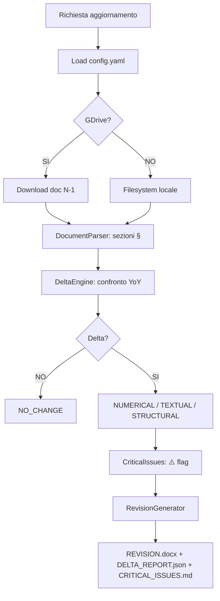

valbruna-tp-dpc

**Version:** 1.1 | **Scope:** Analisi delta annuale documenti Transfer Pricing (DN + MF)  
**Target:** Acciaierie Valbruna SpA + Amenduni Nicola SpA | **GDrive:** ✅ Opzionale

---

## 🎯 OBIETTIVO

Automatizza l'aggiornamento annuale dei documenti TP riducendo l'effort del ~90%:

1. Lettura DOCX da filesystem locale o Google Drive
2. Analisi Delta YoY sezione per sezione
3. Flagging tematiche critiche (prezzi, metodi, nuove controparti)
4. Output con track changes minimali + report JSON + Markdown

---

## 📊 WORKFLOW



---

## 🗂️ DOCUMENTI TARGET (percorsi preconfigurati)

| Tipo | FY24 | FY23 |
|------|------|------|
| Valbruna DN | `FY 24/Valbruna/DN/Acciaierie Valbruna DN FY 24 Final.docx` | `FY 23/Valbruna/DN/Acciaierie Valbruna DN FY 23 Final.docx` |
| Valbruna MF | `FY 24/Valbruna/MF/Valbruna MF FY24 Final Draft.docx` | `FY 23/Valbruna/MF/Valbruna MF FY23 Final Draft.docx` |
| Amenduni DN | `FY 24/Amenduni/DN/Amenduni Nicola DN FY 24  Final.docx` | `FY 23/Amenduni/DN/Amenduni Nicola DN FY 23 Final.docx` |
| Amenduni MF | `FY 24/Amenduni/MF/Amenduni MF Final FY24.docx` | `FY 23/Amenduni/MF/Amenduni MF FY23 Final.docx` |

---

## 🚀 UTILIZZO RAPIDO

```powershell
$PY = "C:\Users\luca.consalter\AppData\Local\Python\pythoncore-3.14-64\python.exe"

# Singolo documento
& $PY src/main.py --doc-type valbruna_dn --current-fy fy24 --previous-fy fy23 --flag-critical-issues

# Tutti e 4 i documenti in sequenza
.\run_tp_annual_update.ps1

# Solo check pre-firma
& $PY src/main.py --current-doc "file.docx" --check-only
```

**Output generati in `./output/`:**

- `*_REVISION_YYYYMMDD.docx` — track changes visivi (rosso barrato → giallo grassetto)
- `DELTA_REPORT_YYvsYY.json` — analisi JSON completa
- `CRITICAL_ISSUES_YYYYMMDD.md` — issue prioritizzate

---

## ⚙️ SOGLIE DELTA (configurabili in config.yaml)

| Soglia | Valore | Effetto |
|--------|--------|---------|
| `numerical_tolerance` | 1% | Ignorato se < 1% |
| `price_variance_alert` | 10% | Flag ⚠️ PRICE_VARIANCE |
| `volume_variance_alert` | 15% | Flag ⚠️ VOLUME_VARIANCE |
| `text_similarity_threshold` | 95% | Sotto → cambio testuale |

---

## 📋 TEST RESULTS (15/15 ✅)

```
Python 3.14.0, pytest-9.0.2
TestDocumentParser::test_empty_document                 PASSED
TestDocumentParser::test_extract_numbers_italian_format PASSED
TestDocumentParser::test_parse_multiple_sections        PASSED
TestDocumentParser::test_parse_single_section           PASSED
TestDeltaEngine::test_new_section_flagged               PASSED
TestDeltaEngine::test_no_change_identical_documents     PASSED
TestDeltaEngine::test_numerical_delta_tolerance         PASSED
TestDeltaEngine::test_numerical_update_detected         PASSED
TestDeltaEngine::test_preserved_section_never_changed   PASSED
TestDeltaEngine::test_text_similarity_calculation       PASSED
TestCriticalIssues::test_clean_document_no_issues       PASSED
TestCriticalIssues::test_multiple_tp_methods_warning    PASSED
TestCriticalIssues::test_placeholder_detection          PASSED
TestRevisionGenerator::test_json_report_generated       PASSED
TestRevisionGenerator::test_critical_issues_markdown    PASSED
=================== 15 passed in 1.43s ===================
```

---

## 📁 STRUTTURA FILE

```
skills/tp-delta-analyzer/
├── SKILL.md                    ← Questo file (self-contained)
├── config.yaml                 ← Configurazione Valbruna
├── requirements.txt            ← Dipendenze Python
├── run_tp_annual_update.ps1    ← Script 1-click
├── src/
│   ├── main.py                 ← CLI orchestrator
│   ├── gdrive_connector.py     ← GDrive + fallback locale
│   ├── document_parser.py      ← Parser sezioni § DOCX
│   ├── delta_engine.py         ← Core YoY comparison
│   ├── critical_issues.py      ← Flagging anomalie
│   └── revision_generator.py  ← Output DOCX/JSON/MD
├── templates/
│   ├── delta_report.json
│   └── critical_issues.md
└── tests/
    └── test_delta_engine.py    ← 15 unit test
```

---

## 🗃️ FILE: `requirements.txt`

```text
python-docx>=0.8.11
pandas>=2.0.0
PyYAML>=6.0
google-auth>=2.0.0
google-auth-oauthlib>=1.0.0
google-auth-httplib2>=0.1.0
google-api-python-client>=2.0.0
diff-match-patch>=20200713
pydantic>=2.0.0
pytest>=7.0.0
colorama>=0.4.6
```

**Installazione:**

```powershell
C:\Users\luca.consalter\AppData\Local\Python\pythoncore-3.14-64\python.exe -m pip install -r requirements.txt
```

---

*SKILL.md auto-contenuto — versione consolidata 2026-03-01 | 15/15 test ✅*
*Rinominato da `tp doc valbrunaaaa.md` → `tp-doc-valbruna.md` (fix B2, Giugno 2026)*
