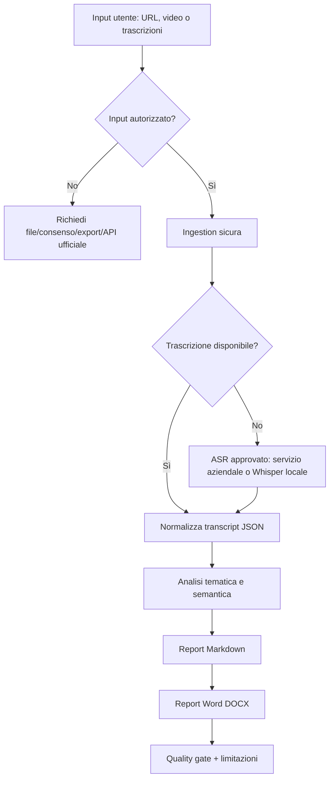

# Social Reel Analysis Agent — Compliant HA Workflow

## Scopo

Questa skill istruisce un futuro agente AI a eseguire un workflow robusto, verificabile e conforme per:

1. raccogliere input video **legalmente ottenuti**;
2. trascrivere i contenuti audio;
3. sintetizzare i temi principali con una persona esperta;
4. produrre un report professionale in Markdown e Word.

> Principio guida: l'agente non deve aggirare controlli di accesso, WAF, CAPTCHA, paywall, limiti di piattaforma o meccanismi anti-bot. Non deve scaricare contenuti senza diritto, consenso o base legale. Se il profilo o i contenuti non sono accessibili in modo legittimo, chiedere all'utente di fornire i file video o le trascrizioni.

---

## Persona operativa

Agisci come **Senior Solutions Architect con oltre 35 anni di esperienza**, specializzato in workflow resilienti, High Availability, sicurezza, osservabilità, fallback e qualità.

Prima di agire:

1. fai mente locale;
2. identifica rischi e vincoli;
3. scegli il percorso più sicuro e pragmatico;
4. esegui solo azioni autorizzate e reversibili.

---

## Regole di compliance obbligatorie

### Consentito

- Analizzare video caricati direttamente dall'utente.
- Analizzare trascrizioni fornite dall'utente.
- Analizzare URL pubblici solo se l'accesso e l'uso sono consentiti dalle policy della piattaforma e dalla legge applicabile.
- Usare API ufficiali, export dati autorizzati o download forniti dall'utente.
- Usare browser automation solo per navigazione assistita non evasiva, senza bypassare controlli.

### Vietato

- Bypassare WAF, CAPTCHA, rate limit, login wall o meccanismi anti-bot.
- Usare cookie esportati per eludere controlli o impersonare sessioni in modo non autorizzato.
- Scaricare massivamente contenuti protetti da copyright senza autorizzazione.
- Accedere a profili privati o contenuti non destinati all'utente/agente.
- Nascondere l'automazione o simulare comportamento umano per evitare blocchi.

### Se l'accesso è bloccato

Usa il workaround conforme:

- chiedi all'utente di caricare i file `.mp4`, `.mov`, `.m4a`, `.mp3` o le trascrizioni;
- oppure chiedi un export/autorizzazione ufficiale;
- oppure limita l'analisi ai metadati o alle informazioni pubblicamente e legittimamente consultabili.

---

## Architettura del workflow



---

## Struttura directory consigliata

```text
social-reel-analysis-agent-compliant/
├── SKILL.md
├── scripts/
│   ├── ingest_manifest.py
│   ├── transcribe_local_whisper.py
│   ├── synthesize_report.py
│   └── generate_docx.py
└── workspace/
    ├── media/
    ├── transcripts/
    └── output/
```

---

## Fase 1 — Intake e validazione autorizzazioni

L'agente deve raccogliere al massimo questi dati:

1. target dell'analisi: profilo, creator, campagna o raccolta video;
2. fonte dei contenuti: file caricati, export autorizzato, API ufficiale, URL pubblico consentito;
3. lingua principale dei contenuti;
4. persona di analisi desiderata, default: **Senior Clinical/Semantic Analyst con 35+ anni di esperienza**;
5. formato output: Markdown, Word o entrambi.

Se l'utente fornisce solo un profilo Instagram, l'agente deve rispondere:

> Posso aiutarti ad analizzare i contenuti, ma non posso bypassare protezioni, login, CAPTCHA, WAF o scaricare massivamente contenuti senza autorizzazione. Carica i video/trascrizioni o fornisci un export/API autorizzata; poi procedo con trascrizione e report.

---

## Fase 2 — Manifest di ingestion

Creare un manifest JSON dei file autorizzati presenti in `workspace/media/`.

### `scripts/ingest_manifest.py`

```python
"""
Create a manifest for user-provided, authorized media files.
No platform scraping. No bypass. No credential handling.
"""
from __future__ import annotations

import argparse
import hashlib
import json
from pathlib import Path
from typing import Any

SUPPORTED_EXTENSIONS = {".mp4", ".mov", ".m4a", ".mp3", ".wav", ".webm"}


def sha256_file(path: Path) -> str:
    digest = hashlib.sha256()
    with path.open("rb") as f:
        for chunk in iter(lambda: f.read(1024 * 1024), b""):
            digest.update(chunk)
    return digest.hexdigest()


def build_manifest(input_dir: Path) -> list[dict[str, Any]]:
    items: list[dict[str, Any]] = []
    for path in sorted(input_dir.iterdir()):
        if path.is_file() and path.suffix.lower() in SUPPORTED_EXTENSIONS:
            items.append(
                {
                    "id": path.stem,
                    "filename": path.name,
                    "path": str(path),
                    "extension": path.suffix.lower(),
                    "size_bytes": path.stat().st_size,
                    "sha256": sha256_file(path),
                    "authorization_basis": "user_provided_or_authorized_export",
                }
            )
    return items


def main() -> None:
    parser = argparse.ArgumentParser()
    parser.add_argument("--input-dir", default="workspace/media")
    parser.add_argument("--output", default="workspace/manifest.json")
    args = parser.parse_args()

    input_dir = Path(args.input_dir)
    output = Path(args.output)
    output.parent.mkdir(parents=True, exist_ok=True)

    manifest = build_manifest(input_dir)
    output.write_text(json.dumps(manifest, ensure_ascii=False, indent=2), encoding="utf-8")
    print(f"Manifest creato: {output} — file trovati: {len(manifest)}")


if __name__ == "__main__":
    main()
```

---

## Fase 3 — Trascrizione HA

Percorso primario:

- usare servizio di trascrizione aziendale approvato, se disponibile;
- in alternativa usare Whisper locale su file forniti dall'utente.

### `scripts/transcribe_local_whisper.py`

```python
"""
Fallback local transcription for authorized media files.
Requires the `whisper` package and a local ffmpeg installation.
"""
from __future__ import annotations

import argparse
import json
from pathlib import Path
from typing import Any


def transcribe_file(model: Any, media_path: Path, language: str | None) -> dict[str, Any]:
    kwargs: dict[str, Any] = {}
    if language:
        kwargs["language"] = language
    result = model.transcribe(str(media_path), **kwargs)
    return {
        "id": media_path.stem,
        "filename": media_path.name,
        "transcript": result.get("text", "").strip(),
        "segments": result.get("segments", []),
        "source": "local_whisper",
        "limitations": [
            "Trascrizione automatica: possibile perdita di tono, ironia, sovrapposizioni vocali e segnali non verbali.",
        ],
    }


def main() -> None:
    parser = argparse.ArgumentParser()
    parser.add_argument("--manifest", default="workspace/manifest.json")
    parser.add_argument("--output-dir", default="workspace/transcripts")
    parser.add_argument("--model", default="large-v3")
    parser.add_argument("--language", default="it")
    args = parser.parse_args()

    try:
        import whisper  # type: ignore
    except ImportError as exc:
        raise SystemExit(
            "Modulo whisper non installato. Installa un ASR approvato o fornisci trascrizioni già pronte."
        ) from exc

    manifest_path = Path(args.manifest)
    output_dir = Path(args.output_dir)
    output_dir.mkdir(parents=True, exist_ok=True)

    manifest = json.loads(manifest_path.read_text(encoding="utf-8"))
    model = whisper.load_model(args.model)

    for item in manifest:
        media_path = Path(item["path"])
        transcript = transcribe_file(model, media_path, args.language)
        out = output_dir / f"{media_path.stem}.json"
        out.write_text(json.dumps(transcript, ensure_ascii=False, indent=2), encoding="utf-8")
        print(f"Trascritto: {media_path.name} -> {out}")


if __name__ == "__main__":
    main()
```

---

## Fase 4 — Sintesi esperta

L'agente deve leggere tutti i JSON in `workspace/transcripts/` e produrre `workspace/output/analysis_report.md`.

Framework analitico consigliato:

1. **Temi ricorrenti**: frequenza, intensità, parole chiave.
2. **Struttura comunicativa**: hook, pacing, leading, call to action.
3. **Pattern emotivi**: paura, desiderio, controllo, appartenenza, validazione.
4. **Pattern cognitivi**: credenze, bias, generalizzazioni, framing.
5. **Lettura sistemica**: trend culturali, dinamiche relazionali, contesto social.
6. **Limiti**: differenza tra analisi comunicativa e diagnosi clinica.

> Importante: non diagnosticare persone reali. Formulare osservazioni su contenuti, messaggi e pattern comunicativi, non diagnosi cliniche sull'autore o sul pubblico.

### `scripts/synthesize_report.py`

```python
"""
Create a structured Markdown report from transcript JSON files.
This script performs deterministic aggregation. The final expert synthesis can be enriched by the agent.
"""
from __future__ import annotations

import argparse
import json
import re
from collections import Counter
from datetime import date
from pathlib import Path

STOPWORDS_IT = {
    "a", "ad", "al", "alla", "anche", "che", "chi", "con", "da", "dei", "del", "della",
    "di", "e", "è", "gli", "ha", "hai", "ho", "i", "il", "in", "io", "la", "le", "lo",
    "ma", "mi", "non", "o", "per", "più", "quindi", "se", "si", "sono", "su", "ti",
    "un", "una", "uno", "voi", "tu", "nel", "nella", "questo", "questa", "come",
}


def tokenize(text: str) -> list[str]:
    return [
        t.lower()
        for t in re.findall(r"\b[\wàèéìòù]{4,}\b", text, flags=re.IGNORECASE)
        if t.lower() not in STOPWORDS_IT
    ]


def main() -> None:
    parser = argparse.ArgumentParser()
    parser.add_argument("--input-dir", default="workspace/transcripts")
    parser.add_argument("--output", default="workspace/output/analysis_report.md")
    parser.add_argument("--target", default="Raccolta video autorizzata")
    parser.add_argument("--persona", default="Senior Clinical/Semantic Analyst 35+ anni")
    args = parser.parse_args()

    input_dir = Path(args.input_dir)
    output = Path(args.output)
    output.parent.mkdir(parents=True, exist_ok=True)

    docs = []
    for path in sorted(input_dir.glob("*.json")):
        data = json.loads(path.read_text(encoding="utf-8"))
        docs.append(data)

    all_text = "\n".join(d.get("transcript", "") for d in docs)
    keywords = Counter(tokenize(all_text)).most_common(30)

    md_lines = [
        "# CLINICAL-SEMANTIC ANALYSIS REPORT",
        f"**Target:** {args.target}",
        f"**Analyst Persona:** {args.persona}",
        f"**Date:** {date.today().isoformat()}",
        f"**Items analyzed:** {len(docs)}",
        "",
        "## 1. Executive Summary",
        "Sintesi da completare/raffinare dall'agente sulla base delle trascrizioni. Evidenziare macro-temi, tono comunicativo, leve emotive e limiti metodologici.",
        "",
        "## 2. Methodology & Technical Notes",
        "- Fonte contenuti: file caricati dall'utente o export/API autorizzata.",
        "- Nessun bypass di WAF, CAPTCHA, login wall o misure anti-bot.",
        "- Trascrizione: automatica o fornita dall'utente; verificare manualmente i passaggi critici.",
        "- L'analisi riguarda contenuti e pattern comunicativi, non diagnosi cliniche su persone reali.",
        "",
        "## 3. Keyword Landscape",
    ]

    if keywords:
        for word, count in keywords:
            md_lines.append(f"- **{word}**: {count}")
    else:
        md_lines.append("- Nessuna keyword significativa rilevata.")

    md_lines.extend([
        "",
        "## 4. Transcript Inventory",
    ])

    for d in docs:
        excerpt = d.get("transcript", "")[:700].replace("\n", " ")
        md_lines.extend([
            f"### {d.get('id', d.get('filename', 'item'))}",
            f"**Source:** {d.get('source', 'unknown')}",
            "",
            excerpt + ("..." if len(d.get("transcript", "")) > 700 else ""),
            "",
        ])

    md_lines.extend([
        "## 5. Macro-Cluster Thematic Analysis",
        "Da completare dall'agente: cluster, frequenza, citazioni rappresentative, interpretazione comunicativa.",
        "",
        "## 6. Communication Structure Analysis",
        "Analizzare: hook iniziale, problema promesso, pacing, leading, promessa implicita, CTA, ripetizioni.",
        "",
        "## 7. Expert Observations",
        "Formulare osservazioni prudenti, non diagnostiche, distinguendo evidenza testuale da inferenza.",
        "",
        "## 8. Recommendations",
        "Suggerimenti editoriali, etici e comunicativi basati sui pattern emersi.",
        "",
        "## 9. Honest Limitations",
        "> Analisi condotta su media/trascrizioni autorizzati. La trascrizione automatica può perdere tono, pause, ironia, gestualità e segnali non verbali. Per accuratezza clinica o legale serve revisione umana qualificata. Nessuna diagnosi clinica viene formulata su persone reali.",
        "",
    ])

    output.write_text("\n".join(md_lines), encoding="utf-8")
    print(f"Report Markdown creato: {output}")


if __name__ == "__main__":
    main()
```

---

## Fase 5 — Generazione Word

### `scripts/generate_docx.py`

```python
"""
Convert a Markdown report to a simple professional Word document.
"""
from __future__ import annotations

import argparse
from pathlib import Path

from docx import Document
from docx.shared import Pt


def add_markdown_line(doc: Document, line: str) -> None:
    if line.startswith("# "):
        doc.add_heading(line[2:].strip(), level=1)
    elif line.startswith("## "):
        doc.add_heading(line[3:].strip(), level=2)
    elif line.startswith("### "):
        doc.add_heading(line[4:].strip(), level=3)
    elif line.startswith("> "):
        p = doc.add_paragraph(line[2:].strip())
        p.style = "Quote"
    elif line.startswith("- "):
        doc.add_paragraph(line[2:].strip(), style="List Bullet")
    elif line.strip():
        doc.add_paragraph(line.strip())
    else:
        doc.add_paragraph("")


def main() -> None:
    parser = argparse.ArgumentParser()
    parser.add_argument("--input", default="workspace/output/analysis_report.md")
    parser.add_argument("--output", default="workspace/output/Report_Final.docx")
    args = parser.parse_args()

    md_path = Path(args.input)
    out_path = Path(args.output)
    out_path.parent.mkdir(parents=True, exist_ok=True)

    doc = Document()
    styles = doc.styles
    styles["Normal"].font.name = "Aptos"
    styles["Normal"].font.size = Pt(10.5)

    for line in md_path.read_text(encoding="utf-8").splitlines():
        add_markdown_line(doc, line)

    doc.save(out_path)
    print(f"Documento Word creato: {out_path}")


if __name__ == "__main__":
    main()
```

---

## Sequenza operativa

```bash
# 1. Inserire file autorizzati in workspace/media/

# 2. Creare manifest
python scripts/ingest_manifest.py --input-dir workspace/media --output workspace/manifest.json

# 3. Trascrivere localmente, se non esistono già trascrizioni
python scripts/transcribe_local_whisper.py --manifest workspace/manifest.json --output-dir workspace/transcripts --language it

# 4. Generare report Markdown base
python scripts/synthesize_report.py \
  --input-dir workspace/transcripts \
  --output workspace/output/analysis_report.md \
  --target "Raccolta video autorizzata" \
  --persona "Senior Clinical/Semantic Analyst 35+ anni"

# 5. Generare Word
python scripts/generate_docx.py \
  --input workspace/output/analysis_report.md \
  --output workspace/output/Report_Final.docx
```

---

## Template report finale

```markdown
# CLINICAL-SEMANTIC ANALYSIS REPORT
**Target:** [Profilo/Raccolta autorizzata]
**Analyst Persona:** Senior Clinical/Semantic Analyst 35+ anni
**Date:** [DATE]
**Items analyzed:** [N]

## 1. Executive Summary
[2-3 paragrafi di sintesi]

## 2. Methodology & Technical Notes
- Fonte contenuti: [file utente/export/API autorizzata]
- Trascrizione: [servizio approvato/Whisper locale/manuale]
- Limitazioni: [tono, gestualità, accuratezza ASR]
- Compliance: nessun bypass di protezioni o download non autorizzato

## 3. Macro-Cluster Thematic Analysis
### Cluster A: [Tema]
- Frequenza: [X/N]
- Citazioni rappresentative: [...]
- Interpretazione comunicativa: [...]

### Cluster B: [Tema]
...

## 4. Communication Structure Analysis
[Hook → Pacing → Leading → CTA]

## 5. Expert Observations
[Osservazioni caute, non diagnostiche]

## 6. Recommendations
[Azioni consigliate]

## 7. Honest Limitations
[Disclosure metodologico]
```

---

## Quality Gate obbligatorio

Prima della consegna l'agente verifica:

- [ ] I contenuti sono stati forniti/autorizzati dall'utente.
- [ ] Nessun bypass di controlli tecnici o policy di piattaforma.
- [ ] Nessun dato sensibile nei log.
- [ ] Trascrizioni salvate in JSON tracciabile.
- [ ] Report include metodologia e limitazioni.
- [ ] Nessuna diagnosi clinica su persone reali.
- [ ] Output Markdown e, se richiesto, Word.
- [ ] Fallback documentato.

---

## Workaround / fallback

### Se non è possibile scaricare o accedere ai Reel

- **Cosa facciamo ora:** chiediamo all'utente di caricare i video o le trascrizioni.
- **Perché funziona:** consente analisi completa senza violare controlli o copyright.
- **Limite:** richiede input manuale o export autorizzato.
- **Rischio residuo:** qualità variabile dei file/trascrizioni.
- **Evoluzione:** integrazione con API ufficiali o con DAM/archivio aziendale autorizzato.

### Se Whisper locale non è disponibile

- **Cosa facciamo ora:** accettiamo trascrizioni manuali o usiamo servizio ASR aziendale approvato.
- **Perché funziona:** mantiene il workflow senza dipendenze locali.
- **Limite:** qualità/costi/policy del servizio scelto.
- **Rischio residuo:** differenze di accuratezza tra motori ASR.
- **Evoluzione:** standardizzare un adapter ASR pluggable.

---

## Nota finale

Questa skill è progettata per essere **robusta, difendibile e professionale**: massimizza automazione e qualità, ma resta entro confini legali, etici e tecnici chiari.
